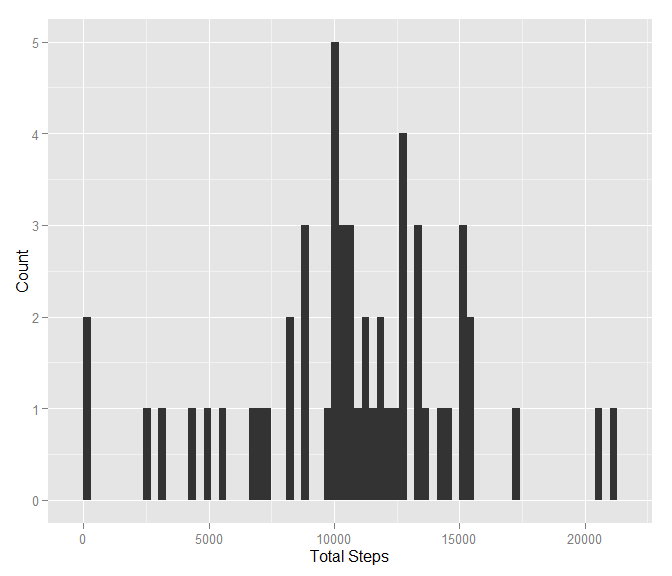
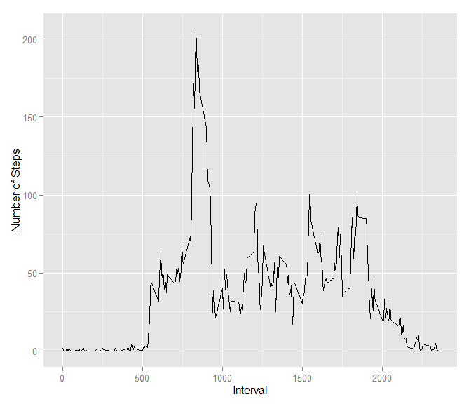
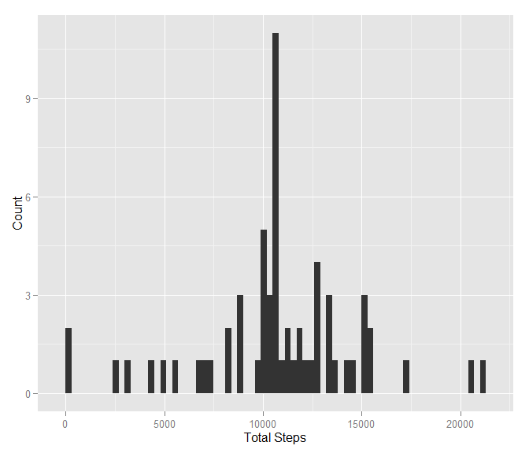
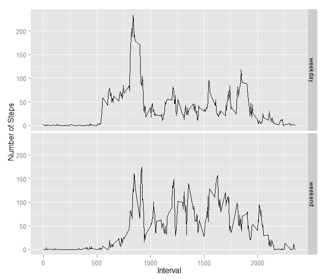

Assignment 1 - Week 2, Reproducible Research
========================================================

###Loading and preprocessing the data

Read and Process data to calculate sum and mean steps per day (NA for missing values)


```r
sourcedat <- read.csv("activity.csv")
rawdat <- sourcedat
rawdat <- rawdat[which(rawdat$steps != "NA"),]
rawdat <- droplevels(rawdat)
library(reshape)
sumsteps <- melt(tapply(rawdat$steps, rawdat$date, sum))
colnames(sumsteps) <- c("date", "totsteps")
```

###What is mean total number of steps taken per day?

Plotting a histogram of the total number of steps taken each day


```r
library(ggplot2)
ggplot(sumsteps, aes(x=totsteps)) + geom_histogram(binwidth = 300) + xlab("Total Steps") + ylab("Count")
```

 

Calculating the mean and median total number of steps taken per day


```r
meanperday <- mean(sumsteps$totsteps)
medianperday <- median(sumsteps$totsteps)
```

The mean total number of steps per day is 1.0766 &times; 10<sup>4</sup> and the median total number of steps per day is 10765

###What is the average daily activity pattern?

Prepare the data for plotting time series plot of mean steps per interval


```r
meanstepsperint <- melt(tapply(rawdat$steps, rawdat$interval, mean))
colnames(meanstepsperint) <- c("interval", "mean")
```

Plotting the time series plot of mean steps per  interval

```r
ggplot(meanstepsperint, aes(interval, mean)) + geom_line() + xlab("Interval") + ylab("Number of Steps")
```

 

###Inputting missing values

Calculating the total number of rows with NA values

```r
numNA <- dim(sourcedat)[1] - dim(rawdat)[1]
```

The total number of rows with NA values is 2304

Replacing NA values with mean for each interval and creating a new dataset with missing vlues subsetted in. Then processing data for plotting.


```r
withmean <- sourcedat
withmean$mean <- rep(meanstepsperint$mean)
for(i in 1:nrow(withmean)){
        withmean$steps[i][is.na(withmean$steps[i])] <- withmean$mean[i]
}
nomissing <- withmean[,1:3]

sumsteps2 <- melt(tapply(nomissing$steps, nomissing$date, sum))
colnames(sumsteps2) <- c("date", "totsteps")
```

Plotting a new histogram of the total number of steps taken each day


```r
library(ggplot2)
ggplot(sumsteps2, aes(x=totsteps)) + geom_histogram(binwidth = 300) + xlab("Total Steps") + ylab("Count")
```

 

Calculating the new mean and median total number of steps taken per day


```r
meanperday2 <- mean(sumsteps2$totsteps)
medianperday2 <- median(sumsteps2$totsteps)
```

The mean total number of steps per day is 1.0766 &times; 10<sup>4</sup> and the median total number of steps per day is 10765

As the missing values were replaced by the mean values for each interval, the total mean and median per day remained unchanged. However, the histogram of the total number of steps taken each day shows higher values at each non-zero intervals. Therefore the estimate of total daily number of steps increases.

###Are there differences in activity patterns between weekdays and weekends?


```r
rawdat$date <- as.Date(rawdat$date)
rawdat$day <- weekdays(rawdat$date)
rawdat$day <- gsub("Monday", "weekday", rawdat$day)
rawdat$day <- gsub("Tuesday", "weekday", rawdat$day)
rawdat$day <- gsub("Wednesday", "weekday", rawdat$day)
rawdat$day <- gsub("Thursday", "weekday", rawdat$day)
rawdat$day <- gsub("Friday", "weekday", rawdat$day)
rawdat$day <- gsub("Saturday", "weekend", rawdat$day)
rawdat$day <- gsub("Sunday", "weekend", rawdat$day)

meanperintperday <- with(rawdat, tapply(steps, list(interval, day), mean))
meanperintperday <- as.data.frame(meanperintperday)
meanperintperday$interval <- as.integer(rownames(meanperintperday))
row.names(meanperintperday) <- NULL
meltmeans <- melt(meanperintperday, id.vars = "interval", measure.vars = c("weekday", "weekend"))
colnames(meltmeans) <- c("Interval", "Day", "Mean")
```

Plotting the time series plot of the 5-minute interval and the average number of steps taken, averaged across all weekday days or weekend days


```r
ggplot(meltmeans, aes(Interval, Mean)) + geom_line() + xlab("Interval") + ylab("Number of Steps") + facet_grid(Day ~ .)
```

 

